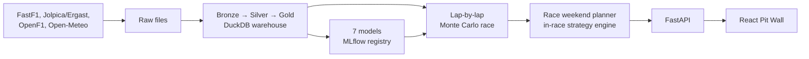

# RaceIQ

**Formula 1 race strategy, planned and tested against real races.**

RaceIQ plans a driver's race weekend: which tyre sets to use in practice
and which to save, which compound to start on, when to pit, and how long
to hold out for a safety car before pitting anyway. It does this by
simulating the race lap by lap, thousands of times, with the whole field
on track, and it is checked against how real races actually finished.

It covers every race on the current calendar, including ones that haven't
happened yet (from the circuit's history, the weather forecast and the
expected grid), and updates through the weekend as practice and
qualifying come in.

---

## What's in it

The web app (the "Pit Wall") has six pages:

| Page | What it answers |
|---|---|
| **Race Weekend** | The plan for one driver at one race: starting tyre, pit windows, the "wait for a safety car or pit now" call for each stop, tyre sets to save, and the expected finish. Defaults to the next race on the calendar. |
| **Race Strategy** | Mid-race: from any lap of a race already run, what should this driver do now, and what happens if they try something else. |
| **Circuit** | Track map, corners, and what each circuit does to tyres, safety cars and overtaking. |
| **Car** | Where each car is fast (straight-line speed against race pace) and how hard it is on its tyres, with a written reading of why. |
| **Driver** | A driver's season: results, grid against finish race by race, and pace against their teammate in the dry and the wet. |
| **Model Perf** | How each model is doing on the 2026 season so far (races it never saw), and whether its inputs have drifted from what it was trained on. |

## How it works



- **Data.** Every race since 2018: lap times, tyres, pit stops, weather,
  race control, results and qualifying, plus practice sessions for recent
  seasons. It lands as raw files, then gets cleaned and joined in three
  DuckDB layers (bronze, silver, gold). One cleaning example: the timing
  data starts a new "stint" whenever a car goes through the pit lane, even
  without a tyre change, so the silver layer counts a stop only when the
  tyres actually change.
- **Models** (LightGBM and a PyTorch LSTM, tracked in MLflow): lap time,
  tyre degradation, pit stop, safety car, win probability, final position,
  and a lap-time sequence model.
- **The race simulation.** Every car advances one lap at a time. A car
  close behind another loses time in its dirty air and only gets past if
  it's quick enough, by a margin that depends on how hard the circuit is
  to pass at. Pit stops, safety cars (which make a stop cheaper) and
  retirements happen during the race. Each car's pace comes from its
  season form and its qualifying gap, and mid-race from what it has shown
  so far. Rivals pit the way real cars have at that circuit. Tyre wear is
  measured per season and scaled to how hard each circuit is on tyres.
- **Regulation eras matter.** 2018–21, 2022–25 and 2026 onwards are
  different sports for tyres, reliability and overtaking. Stop patterns,
  form and car profiles are taken from the right era, and concepts that
  don't exist in an era (DRS in 2026) are left out rather than set to zero.

## How accurate is it?

Everything is checked against real finishing positions, on races the
models were not trained on.

**Before the race**: every car simulated from its real grid slot,
compared with where it really finished.

| Season | Error in finishing place | Rank correlation |
|---|---|---|
| 2025 (10 races) | 2.14 | 0.80 |
| 2026 (15 races, new regulations) | 2.10 | 0.87 |

**During the race**: every car from 40% distance, on the strategy it
really used, in races without rain or a red flag.

| Season | Simulation | "Everyone finishes where they are now" |
|---|---|---|
| 2025 | 1.71 places | 2.27 |
| 2026 | 1.78 places | 1.87 |

**What it doesn't do well, measured the same way:**

- The planner's pit laps are about as close to the laps real cars stop on
  as "pit when cars usually pit here" is (about 7 laps off either way).
- It picks the stop count a driver really ran 50–60% of the time, and it
  leans towards one-stops.
- The simulation credits its recommended plan with about 1.6 places over a
  typical strategy, but drivers who really ran that plan's stop count
  finished no better (0.03 ± 0.33 places). So the Race Weekend page leads
  with the finish on a typical strategy and says so.
- Races with a red flag are out of reach: the stoppage hands everyone a
  free tyre change no forecast can see.

Each of these checks is a script you can run (see [Checking it](#checking-it)).
The reasoning, and the things tried and switched off, are written up next
to the code they apply to.

---

## Running it

### You need

- [uv](https://docs.astral.sh/uv/) and Python 3.11 (3.10 or newer)
- Node.js 20+ and npm
- About 10 GB of disk, mostly FastF1's response cache

### 1. Install

```bash
git clone https://github.com/srikarreddyram/raceiq.git
cd raceiq
uv sync
(cd frontend && npm install)
```

Every setting has a working default. To change one, copy `.env.example`
to `.env` and edit it.

### 2. Get the data

```bash
# Every race since 2018. Slow: FastF1 allows about 500 requests an hour,
# so this takes several hours. It's resumable; just run it again.
uv run python -m ingestion.backfill --start-season 2018

# Add practice and qualifying for recent seasons (used for tyre-set advice):
uv run python -m ingestion.backfill --start-season 2025 --sessions FP1,FP2,FP3,Q,R

# The current calendar, including races not yet run, then build the warehouse:
uv run python -m ingestion.ergast.ingest --season 2026
uv run python -m ingestion.refresh_weekend --rebuild-only
```

Optional, for the Circuit page's track maps:

```bash
uv run python -c "from track_maps.reconstruction.fetch import fetch_all; fetch_all()"
uv run python -m track_maps.run
```

### 3. Train the models

```bash
uv run python -m retraining.run
```

This rebuilds the gold layer, trains all seven models, runs the test
suite against them, and promotes them only if every test passes.

### 4. Start the app

```bash
scripts/dev.sh
```

This starts the API and the frontend together and prints the address to
open (normally http://localhost:5173/pitwall). If port 8000 or 5173 is
taken it uses the next free one, and points the frontend at the right API
so the two always find each other. Ctrl-C stops both.

### During a race weekend

```bash
scripts/refresh_weekend.sh
```

This fetches whatever the current weekend has produced so far (practice,
qualifying, the race), catches up any earlier round that was missed, and
rebuilds the warehouse. Run it after qualifying and the planner switches
from the expected grid to the real one. Restart `scripts/dev.sh`
afterwards; the API keeps plans in memory.

A plan from the command line:

```bash
uv run python -m race_plan.plan --race-id 2026_16 --driver norris
```

---

## Checking it

```bash
uv run pytest                                          # the test suite

uv run python -m race_plan.grid_sensitivity            # pre-race accuracy
uv run python -m race_plan.grid_sensitivity --pit-windows    # pit laps against real stops
uv run python -m race_plan.grid_sensitivity --strategy-edge  # is the plan's credit real? (slow)
uv run python -m strategy_engine.validate_in_race      # in-race accuracy
uv run python -m strategy_engine.validate_in_race --season 2026 --rounds 1-15
uv run python -m strategy_engine.validate_in_race --oracle-rivals  # ceiling: rivals' real stops known
uv run python -m monitoring.run                        # input drift and live model accuracy
```

## Project layout

```
ingestion/         fetch from FastF1, Jolpica/Ergast, OpenF1, Open-Meteo; backfill; weekend refresh
pipelines/         bronze → silver → gold, in DuckDB
models/            the seven models, trained and registered in MLflow
strategy_engine/   the lap-by-lap race simulation, strategy search, scoring, in-race engine
race_plan/         the race weekend planner: pace, field, unrun races, tyre sets, safety-car windows
car_profiles/      per-team speed and tyre characteristics
driver_profiles/   per-driver profiles
track_maps/        circuit maps and geometry
monitoring/        drift and live accuracy
retraining/        retrain → test → promote
serving/api/       FastAPI
frontend/          React + TypeScript (Vite)
scripts/           dev.sh, refresh_weekend.sh
tests/             pytest
docs/              product requirements and UI design notes
```

## Data sources

- [FastF1](https://github.com/theOehrly/Fast-F1): lap timing, tyres, telemetry, race control
- [Jolpica-F1](https://github.com/jolpica/jolpica-f1), the community successor to the Ergast API: results, qualifying, calendar
- [OpenF1](https://openf1.org): speed traps and session data
- [Open-Meteo](https://open-meteo.com): historical weather and race-day forecasts

RaceIQ is an independent project. It isn't affiliated with or endorsed by
Formula 1, the FIA or any team.
